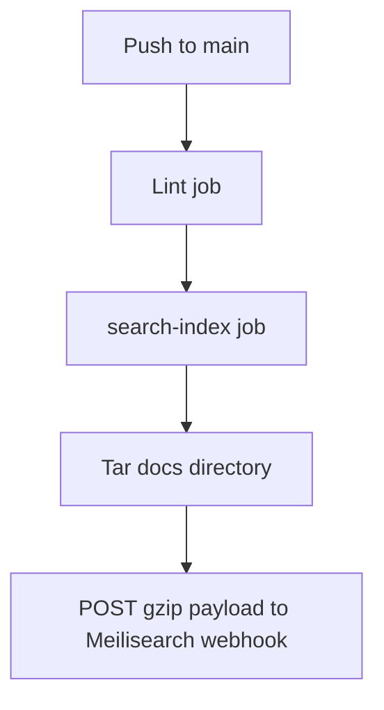

Search is provided by a self-hosted Meilisearch instance. Every push to `main` builds an index payload inside the `search-index` CI job and posts it to the sync webhook defined by `SEARCH_SYNC_WEBHOOK`.

Lorem ipsum dolor sit amet, consectetur adipiscing elit. Fusce fringilla justo ac orci tincidunt, in suscipit turpis interdum.
